# Azure Data Pipeline Assignment Report

## 1. Objective

To understand Azure cloud concepts and build an end-to-end data pipeline using Azure Storage Account and Azure Data Factory (ADF). The assignment covers:

- Creating a Resource Group and Storage Account on Azure Portal
- Uploading a CSV dataset to Blob Storage
- Creating an Azure Data Factory instance and exploring its UI
- Configuring Linked Services, Datasets, and Pipeline Activities
- Executing and monitoring the pipeline
- Assigning IAM roles for secure access

---

## 2. Tools & Services Used

| Tool / Service | Purpose |
|---|---|
| Microsoft Azure Portal | Cloud management interface |
| Azure Resource Group | Organizing all Azure resources |
| Azure Storage Account (Blob) | Source and destination data storage |
| Azure Data Factory V2 | Data pipeline orchestration |
| Get Metadata Activity | Validate file properties before copying |
| Copy Data Activity | Move data from source to destination |
| IAM Role Assignment | Access control between ADF and Storage |

---

## 3. Dataset Used

**File Name:** `superstore.csv`
**Total Records:** 28 rows
**Columns:** Row ID, Order ID, Order Date, Ship Date, Ship Mode, Customer ID, Customer Name, Segment, Country, City, State, Postal Code, Region, Product ID, Category, Sub-Category, Product Name, Sales, Quantity, Discount, Profit

---

## 4. Steps Performed

### Step 1 — Create Resource Group

A Resource Group named `RG-DataPipeline` was created in the **East US** region to logically organize all Azure resources used in this assignment.

**Navigation:** Azure Portal → Resource Groups → + Create

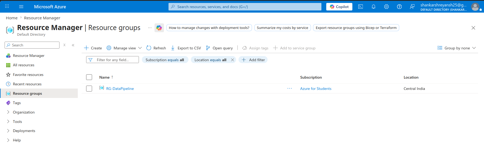

---

### Step 2 — Create Storage Account

A Storage Account named `sadatapipeline2024` was created under the Resource Group `RG-DataPipeline` with Standard performance and LRS (Locally Redundant Storage) redundancy.

**Navigation:** Azure Portal → Storage Accounts → + Create

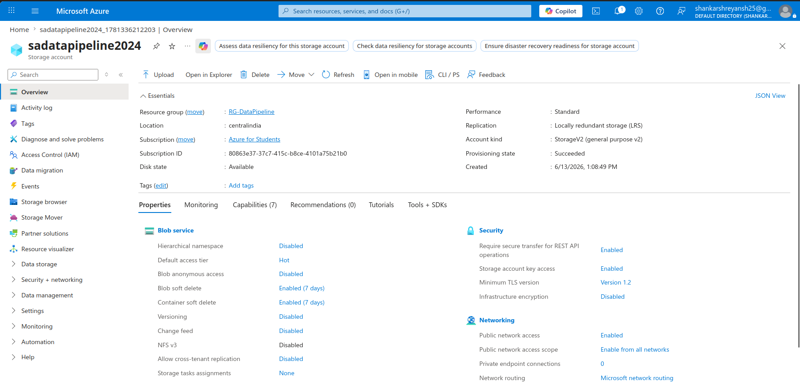

---

### Step 3 — Create Blob Containers

Two Blob Containers were created inside the Storage Account:

- `input-data` — to store the source CSV file
- `output-data` — to store the pipeline's output file

**Navigation:** Storage Account → Containers → + Container

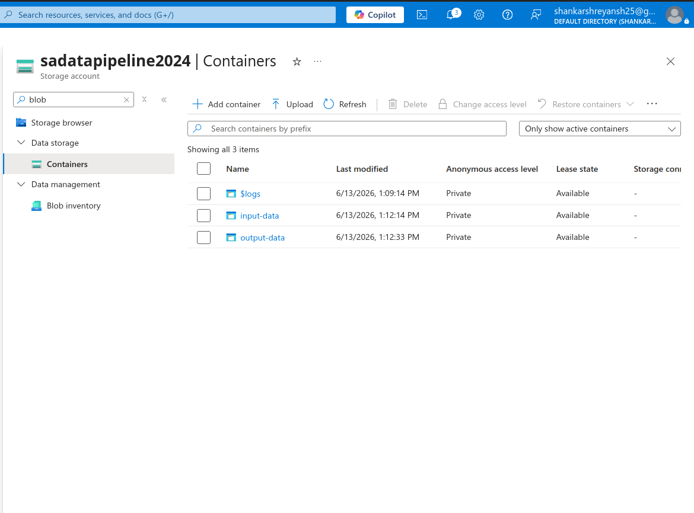

---

### Step 4 — Upload CSV File

The file `superstore.csv` (28 rows of Superstore sales data) was uploaded into the `input-data` container.

**Navigation:** Storage Account → Containers → input-data → Upload

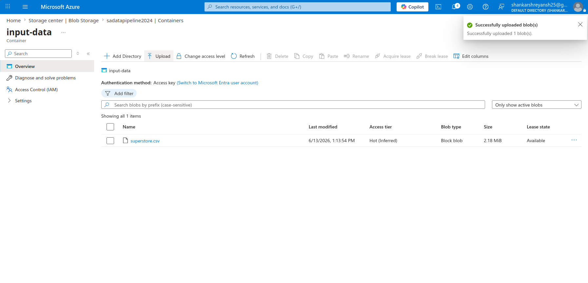

---

### Step 5 — Create Azure Data Factory

An Azure Data Factory instance named `adf-datapipeline-2024` was created under the same Resource Group. After deployment, ADF Studio was launched from the resource page.

**Navigation:** Azure Portal → Data Factories → + Create → Launch Studio

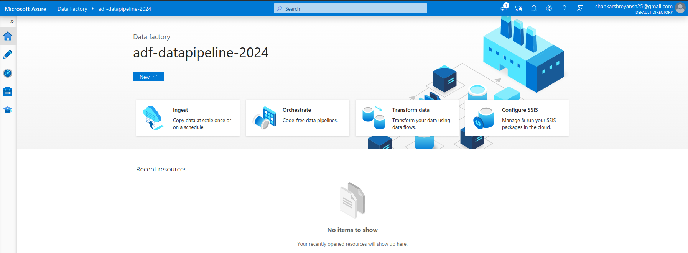

---

### Step 6 — Create Linked Service (Blob Storage)

A Linked Service named `LS_BlobStorage` was created in ADF Studio to establish a connection between ADF and the Azure Blob Storage account. The connection was tested successfully.

**Navigation:** ADF Studio → Manage → Linked Services → + New → Azure Blob Storage

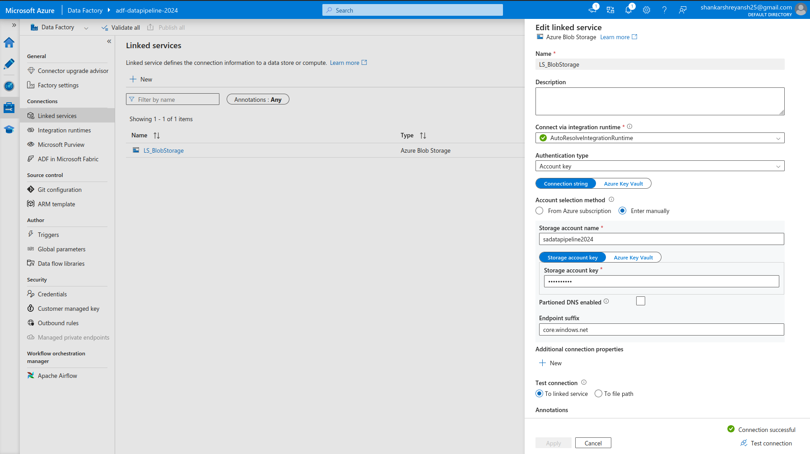

---

### Step 7 — Create Source Dataset

A dataset named `DS_Source_CSV` was created pointing to `input-data/superstore_sales.csv` using the `LS_BlobStorage` linked service. "First row as header" was enabled.

**Navigation:** ADF Studio → Author → Datasets → + New Dataset → Azure Blob Storage → DelimitedText

---

### Step 8 — Create Destination Dataset

A dataset named `DS_Destination_CSV` was created pointing to `output-data/output_sales.csv` using the same linked service.

**Navigation:** ADF Studio → Author → Datasets → + New Dataset → Azure Blob Storage → DelimitedText

---

### Step 9 — Build Pipeline with Get Metadata Activity

A pipeline named `PL_SalesDataPipeline` was created. The **Get Metadata** activity was added and configured with the source dataset (`DS_Source_CSV`) to retrieve the following file properties:

- `Column count`
- `Size`
- `Exists`

**Navigation:** ADF Studio → Author → Pipelines → + New Pipeline → Activities → Get Metadata

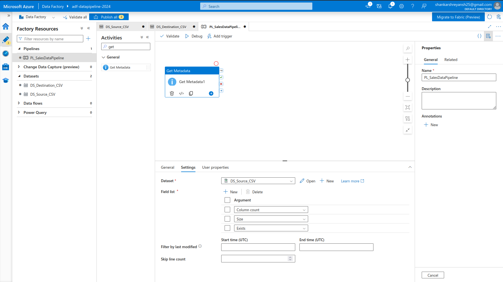

---

### Step 10 — Add Copy Data Activity & Connect Pipeline

The **Copy Data** activity was added to the pipeline canvas and connected to the Get Metadata activity (success path). Configuration:

- **Source:** `DS_Source_CSV`
- **Sink:** `DS_Destination_CSV`
- **Copy Behavior:** Preserve Hierarchy

The complete pipeline flow: `Get Metadata → Copy Data`

**Navigation:** Activities Panel → Copy Data → drag onto canvas → connect to Get Metadata

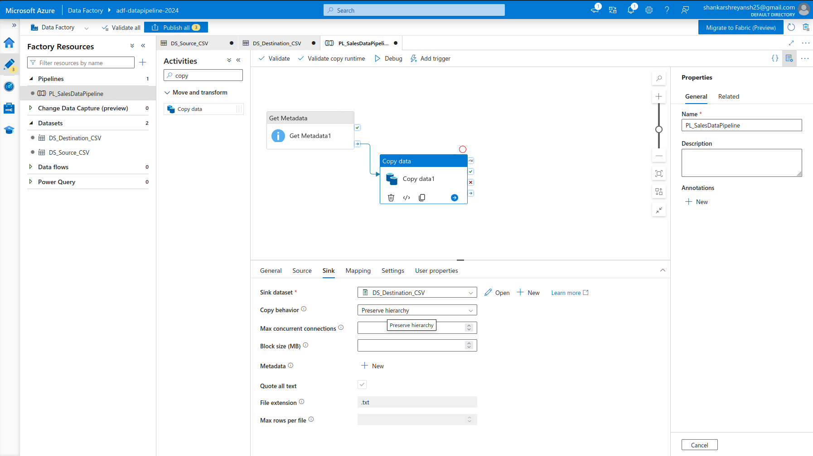

---

### Step 11 — Assign IAM Roles

IAM roles were assigned to ensure secure access between ADF and the Storage Account:

| Role | Assigned To |
|---|---|
| Storage Blob Data Contributor | ADF instance (`adf-datapipeline-2024`) |
| Reader | User account |

**Navigation:** Storage Account → Access Control (IAM) → + Add Role Assignment

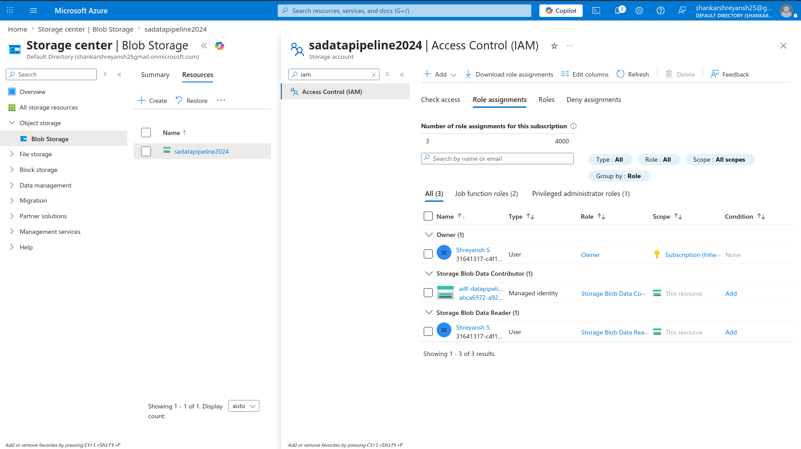

---

### Step 12 — Publish Pipeline

All changes (Linked Services, Datasets, Pipeline) were published to ADF's live mode using the **Publish All** button.

**Navigation:** ADF Studio → Publish All → Publish

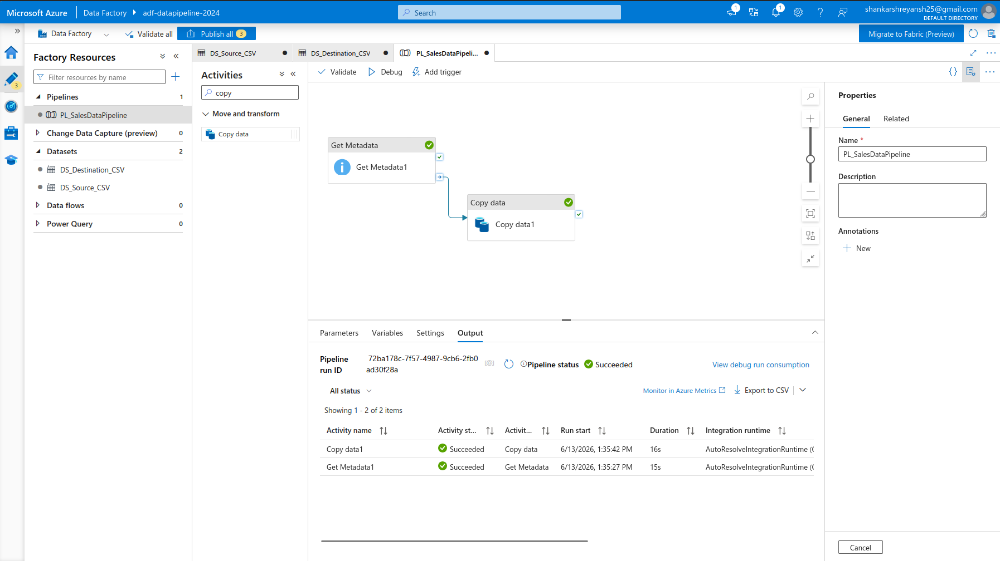

---

### Step 13 — Execute Pipeline (Debug Run)

The pipeline was executed using the **Debug** option. Both activities completed successfully:

- Get Metadata: ✅ Succeeded
- Copy Data: ✅ Succeeded

**Navigation:** ADF Studio → Pipeline → Debug (top toolbar)

---

### Step 14 — Add Trigger

A schedule trigger named `TR_Manual` was created and attached to the pipeline to enable automated execution.

- **Type:** Schedule
- **Recurrence:** Every 1 Day (or One Time)

**Navigation:** Pipeline → Add Trigger → New/Edit → + New

---

### Step 15 — Monitor Pipeline Execution

Pipeline execution was monitored via the **Monitor** tab in ADF Studio. Activity-level details were reviewed including rows read and rows written.

**Navigation:** ADF Studio → Monitor → Pipeline Runs

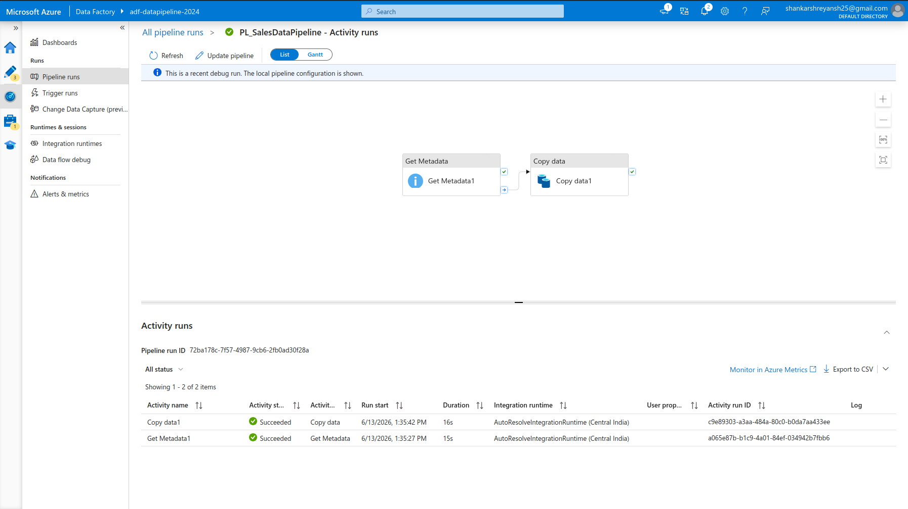

---

### Step 16 — Verify Output File in Blob Storage

After the pipeline run, the output file `output_sales.csv` was found in the `output-data` container, confirming successful data transfer.

**Navigation:** Storage Account → Containers → output-data

---

## 5. Pipeline Summary

| Property | Value |
|---|---|
| Pipeline Name | `PL_SalesDataPipeline` |
| Source | `input-data/superstore_sales.csv` |
| Destination | `output-data/output_sales.csv` |
| Activities Used | Get Metadata + Copy Data |
| Rows Copied | 28 |
| Execution Method | Debug + Schedule Trigger |
| Final Status | ✅ Succeeded |

---

## 6. Conclusion

In this assignment, an end-to-end data pipeline was successfully built on Microsoft Azure. A **Resource Group** was created to organize all resources, followed by a **Storage Account** with two Blob containers — `input-data` (source) and `output-data` (destination) — with the Superstore Sales CSV file uploaded as the source data.

An **Azure Data Factory** instance was configured with a **Linked Service** connecting ADF to Blob Storage. Source and destination datasets were defined, and a pipeline was designed using the **Get Metadata** activity (to validate file existence, size, and column count) and a **Copy Data** activity (to transfer data from input to output container).

**IAM roles** were assigned to ensure ADF had the necessary permissions to access Blob Storage securely. The pipeline was published, executed via Debug mode, and monitored through ADF's Monitor tab — confirming all 28 rows were successfully copied from source to destination.